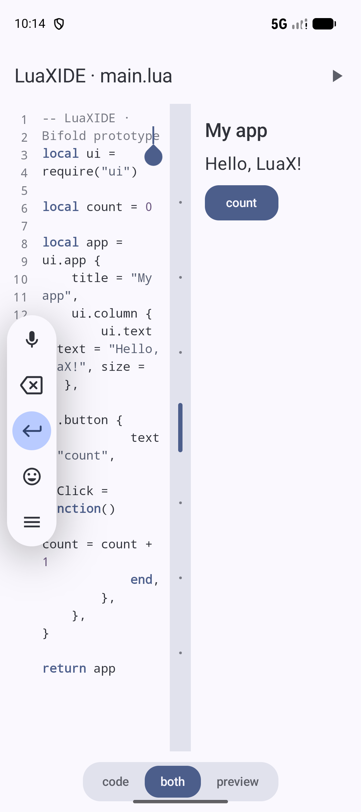

# LuaXIDE

在 Android 设备上编写、运行、调试 Lua,并直接把脚本打包成独立可安装的 App —— 全程无需 root。

<p align="center">
  
</p>

## 它能做什么

- **写** — 语法高亮编辑器 + 组件面板,双栏自适应布局(代码 / 预览 / 同显)
- **跑** — 自研 Lua 解释器即时执行:脚本返回 UI 树 → 可视化预览;纯 print 程序 → 内置终端
- **调** — 断点 / 条件断点 / logpoint、单步与步出、局部变量与调用栈、监视与表达式求值
- **终端** — 交互式 REPL(`=1+2` 语法糖、跨行全局变量)、`io.read` 阻塞输入、`.run` `.stop` `.proot` 命令
- **打包** — 一键把当前项目打包成签名 APK 并安装(改写模板 APK,手机上不需要任何构建工具链)

## 架构

```text
              engine/lx.c   (自研 Lua 解释器 + ui 库 + 调试协议)
                 │ 同一份源码
        ┌────────┴────────┐
   CLI (lx)          libluax.so (JNI)
                          │
        ┌─────────────────┼──────────────────┐
   :app(IDE)                     :runtime(模板 App)
   编辑 / 调试 / 终端 / 打包        RuntimeActivity 渲染 assets/lua/main.lua
        │                              │
        │      release APK 复制为 template.apk
        └──────> ApkPackager:改写包名/版本/资源 → apksig 签名 → 安装
```

- **engine/** — 单文件 C 引擎 `lx.c`:树遍历解释器 + 混合字节码 VM(函数体首次调用时编译执行,不可编译的构造透明回退;数值循环约 11x 加速)。内置 `require("ui")` 声明式 UI 库(输出 JSON UI 树)、stdin 阻塞队列、协作式取消、`lx_debug_*` 调试协议。同一份源码编译为桌面 CLI(`make`)与两个 Android 模块的 `libluax.so`(CMake + `luax_jni.c`),详见 [docs/BYTECODE_VM.md](docs/BYTECODE_VM.md)。
- **:runtime** — 极简启动器 App。其 release APK 经 `syncRuntimeTemplate` 任务复制为 `app/src/main/assets/runtime/template.apk`,作为所有打包产物的模板。
- **:app** — IDE 本体(`dev.luaxide`)。运行/预览走 `EngineHost`;打包走 `ApkPackager`(ARSCLib 改写二进制 manifest + apksig 签名,签名密钥为设备上现场生成的 PKCS#12)。

## 无 root 政策

LuaXIDE 永不要求 root / Magisk / su。程序运行在 `filesDir/sandbox/<projectId>/` 沙箱中;可选的 proot 为非特权用户态 rootfs(Termux 构建,随 APK 分发于 `assets/proot/`)。

## 构建与测试

```bash
# 引擎测试套件(t1–t24,需要 clang),通过时输出 ALL TESTS PASSED
make -C engine test

# Android 构建(需要 Android SDK / JDK 17)
./gradlew :app:assembleDebug :runtime:assembleDebug

# 修改 runtime 后同步模板 APK 到 app assets
./gradlew :runtime:syncRuntimeTemplate    # 或 scripts/sync-runtime-template.sh
```

CI 在每个 PR 上运行同样的检查(`engine-tests` 与 `android-build` 两个必需检查),作为合并门禁。

## 文档

- [docs/MODULES_AND_UI.md](docs/MODULES_AND_UI.md) — `require` 模块解析规则与内置 UI 组件清单
- [docs/PROGRAM_MODE.md](docs/PROGRAM_MODE.md) — Program Mode(UI 树 → 预览,否则 → 终端)与交互终端命令
- [docs/PROOT_AND_STDIN.md](docs/PROOT_AND_STDIN.md) — proot 用户态 rootfs、阻塞 stdin 与取消机制

## 第三方组件

引擎与 Kotlin 源码为原创;打包与执行链路使用了若干第三方组件(ARSCLib、apksig、Termux proot 等),清单、版本与许可见 [THIRD_PARTY_NOTICES.md](THIRD_PARTY_NOTICES.md)。

## 参与贡献

欢迎 Issue 与 PR。流程与约定见 [CONTRIBUTING.md](CONTRIBUTING.md);编码代理请先读 [AGENTS.md](AGENTS.md)。

交付环:**Issue → PR(base=main,含 `Fixes #N`)→ CI 门禁 → merge → Issue 自动关闭**。

## License

本项目以 [Apache-2.0](LICENSE) 许可发布;随仓库分发的第三方组件及其许可见 [THIRD_PARTY_NOTICES.md](THIRD_PARTY_NOTICES.md)。
