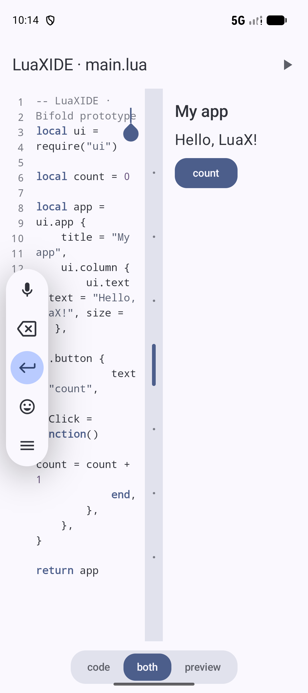

# LuaX

一门为「在手机上写 App」而生的 Lua 方言 —— 页面用 HTML 与 CSS,行为用 Lua,单文件 C 引擎,配一个能把它打包成独立 APK 的 Android IDE(LuaXIDE)。

[English](README.md)

<p align="center">
  
</p>

```lua
-- 这是 LuaX。页面是 index.html,这个文件是逻辑。
local html = require("html")
local count = 0

html.on("plus", "click", function()
  count = count + 1
  html.setText("count", "taps: " .. count)
end)

html.setText("count", "taps: 0")
```

- **HTML 页面**:WebView 渲染真正的 HTML 与 CSS。Lua 登记事件并提交 DOM 操作。JavaScript 与 Python 工程仍使用 JSON UI 树。
- **单文件引擎**:`engine/lx.c` 约 2200 行 C,树遍历 + 字节码 VM 混合执行(数值循环 ~11×)
- **现代标准库**:`string.format` / 模式匹配(`find gsub match gmatch`)/ `math.*` / `table.sort`
- **无 root**:沙箱执行;IDE 一键打包成独立签名 APK
- **三种语言**:LuaX 的页面是 HTML。JavaScript(QuickJS)与 Python(MicroPython)共用 JSON UI 树。

## 三十秒上手

```bash
make -C engine lx          # 编译桌面 CLI(需要 clang)
./engine/lx your.lua       # 运行
./engine/lx --ui your.lua  # 打印 DOM 操作 JSON(桌面检查,不画页面)
```

或安装 LuaXIDE(Android),新建项目即得上述计数器种子;`调试`(断点/单步/监视)与 `控制台`(REPL、`io.read` 回复)都在 IDE 内。

## 语言速览

```lua
-- 标准库一角
print(string.format("%d %s %5.2f", 42, "hi", 3.14159))             -- 42 hi  3.14
print(("2026-09-09"):match("(%d+)-(%d+)-(%d+)"))                    -- 2026 09 09
for w in ("one two three"):gmatch("%a+") do io.write(w, ".") end   -- one.two.three.

local t = {5, 2, 8, 1}
table.sort(t)                                                       -- {1,2,5,8}
print(math.floor(3.7), math.random(1, 6), #t)

-- 词法闭包 + 元表
local proto = { greet = function(self) return "hi " .. self.name end }
local obj = setmetatable({ name = "luax" }, { __index = proto })
print(obj:greet())                                                  -- hi luax
```

LuaX 是 Lua 5.1 的方言子集:闭包与元表都在,数字只有 double、表构造器展开多值、不支持 `goto`/`load`。完整差异与逐函数标准库参考见 **[docs/LUAX.zh-CN.md](docs/LUAX.zh-CN.md)**。

## 文档

每份文档均有英文(默认,规范文件名)与中文(`.zh-CN.md`)两个版本。

| 你想…… | 读 |
|---|---|
| **写 LuaX 程序** | [docs/LUAX.zh-CN.md](docs/LUAX.zh-CN.md) —— 语言参考:方言差异、逐函数标准库、HTML 宿主、元表 |
| 接入 / 对齐其他语言引擎 | [docs/PLATFORM_ABI.zh-CN.md](docs/PLATFORM_ABI.zh-CN.md) —— JavaScript 与 Python 的 JSON UI 树;LuaX 的 HTML 以 LUAX.md 为准 |
| 维护 LuaX 引擎本体 | [docs/ENGINE.zh-CN.md](docs/ENGINE.zh-CN.md) + [docs/BYTECODE_VM.zh-CN.md](docs/BYTECODE_VM.zh-CN.md) —— 架构、测试工作流、扩展 checklist、VM 设计 |
| 了解 IDE 行为 | [docs/PROGRAM_MODE.zh-CN.md](docs/PROGRAM_MODE.zh-CN.md)、[docs/PROOT_AND_STDIN.zh-CN.md](docs/PROOT_AND_STDIN.zh-CN.md) |

> LUAX.md 里每个代码块都被 CI 实际运行过(中英文两份同步校验)—— 文档即测试,失效即红。

## 仓库布局

```
engine/       LuaX 引擎(lx.c)—— 桌面 CLI 与两个 Android 模块共用同一源码
engine-js/    JavaScript 引擎(QuickJS facade),JSON UI 树
engine-py/    Python 引擎(MicroPython facade),JSON UI 树
app/          LuaXIDE 本体(Kotlin + Compose):编辑/调试/控制台/打包
runtime/      打包模板:Lua 页面走 WebView;JS 与 Python 仍渲染 UI 树
docs/         上表所列文档
```

## 构建与测试

```bash
make -C engine test      # Lua 引擎: t1–t28 + bc-diff 差分 + 文档示例门禁 → ALL TESTS PASSED
make -C engine-js test   # JS 引擎: j1–j6 conformance
make -C engine-py test   # Python 引擎: p1–p2
./gradlew :app:assembleDebug :runtime:assembleDebug   # Android(需 SDK / JDK 17)
```

CI 在每个 PR 上运行以上全部(`engine-tests` / `engine-js-tests` / `engine-py-tests` / `android-build` 四个必需检查),作为合并门禁。

## 参与贡献

欢迎 Issue 与 PR。流程与约定见 [CONTRIBUTING.zh-CN.md](CONTRIBUTING.zh-CN.md);编码代理先读 [AGENTS.md](AGENTS.md)。

交付环:**Issue → PR(base=main,含 `Fixes #N`)→ CI 门禁 → merge → Issue 自动关闭**。

## License

本项目以 [Apache-2.0](LICENSE) 许可发布;随仓库分发的第三方组件(QuickJS、ARSCLib、apksig、Termux proot 等)清单与许可见 [THIRD_PARTY_NOTICES.zh-CN.md](THIRD_PARTY_NOTICES.zh-CN.md)。
